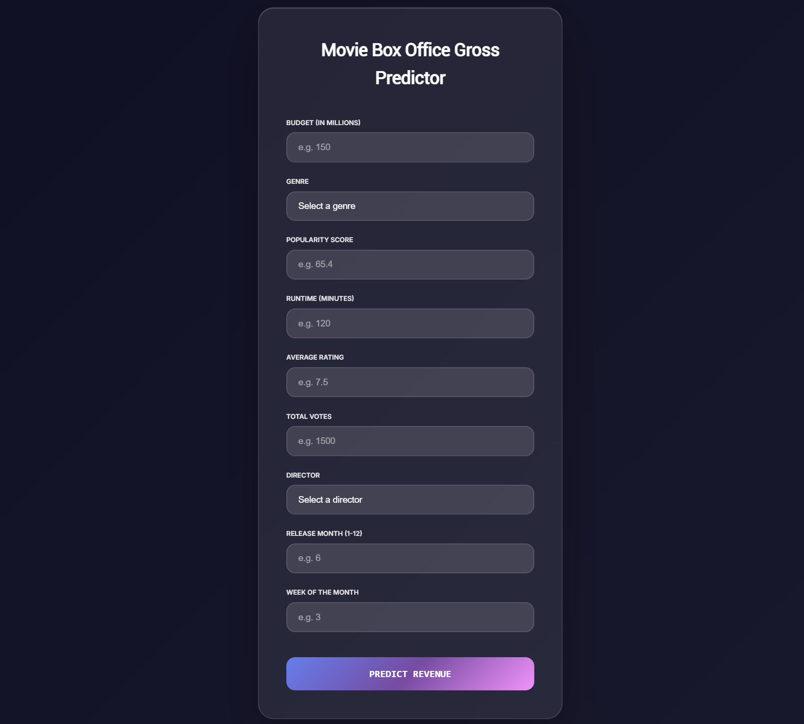
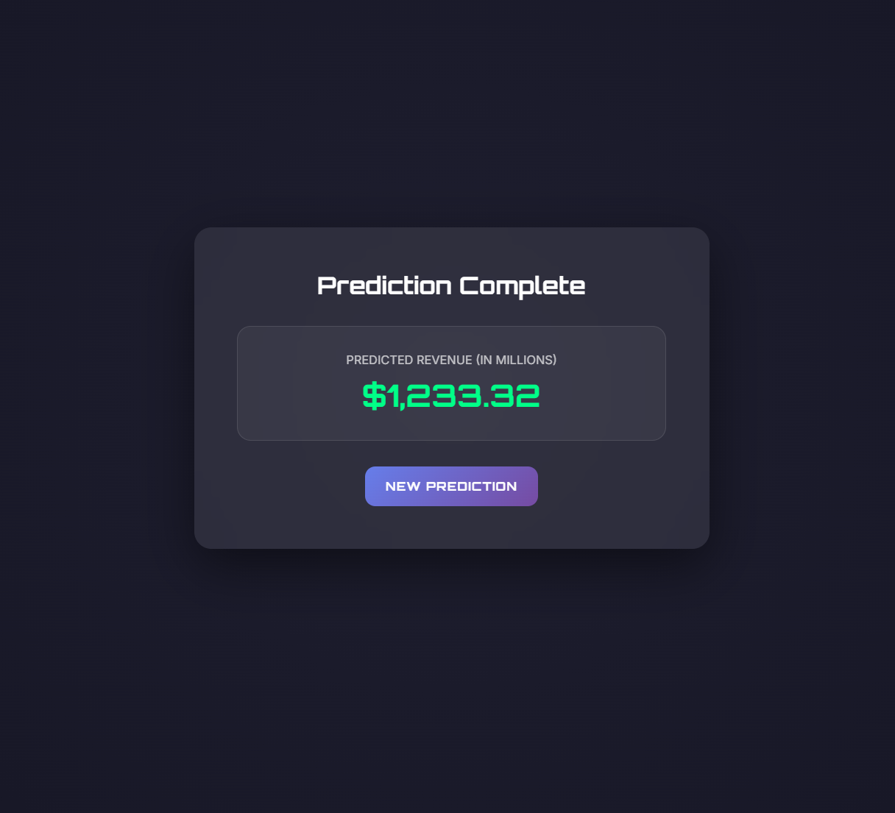

# 🎬 Movie Box Office Gross Predictor

A machine learning-powered web application that predicts the box office revenue of movies using key features like budget, genre, popularity, runtime, director, and release details.

> ⚙️ Built using Flask, Python, HTML/CSS, and Scikit-learn.

---

## 🚀 Live Preview

This app runs locally via Flask. For a publicly hosted version, consider deploying it using platforms like **Streamlit Cloud**, **Render**, or **Heroku**.

---

## 📊 Features

- 🎯 Predicts movie revenue using a Linear Regression model
- 📝 Inputs include budget, genre, popularity, rating, votes, director, and release date
- 🧼 Feature scaling with `StandardScaler`
- 🔣 Encodes categorical features like `genres` and `director`
- 🎨 Clean, modern user interface using HTML/CSS
- 📈 Visualizations for data analysis and feature importance

---

## 🧠 Tech Stack

- **Backend:** Flask, Python
- **Machine Learning:** Scikit-learn (Linear Regression)
- **Frontend:** HTML5, CSS3, Bootstrap
- **Data:** TMDB 5000 Movie Dataset
- **Visualization:** Matplotlib, Seaborn, WordCloud

---

## 📁 Project Structure

<pre>
📦 movie-box-office-predictor
├── app.py
├── model_movies.pkl
├── scaler_movies.pkl
├── label_encoders.pkl
├── templates/
│   ├── Demo2.html
│   └── resultnew.html
├── static/
│   └── styles.css
│   └── styles2.css
├── README.md
└── requirements.txt
</pre>

---

## 🛠️ How to Run Locally

### 1. Clone the Repository

```bash
git clone https://github.com/yourusername/movie-box-office-predictor.git
cd movie-box-office-predictor

2. Create and Activate Virtual Environment

python -m venv venv
# For macOS/Linux:
source venv/bin/activate
# For Windows:
venv\Scripts\activate

3. Install Dependencies

pip install -r requirements.txt

4. Run the Flask App

python app.py

Then open http://127.0.0.1:5000 in your browser to access the app.
```
## 📷 Screenshots

🏠 **Homepage**  


📊 **Prediction Result Page**  


## 📚 Data Source

[TMDB 5000 Movie Dataset on Kaggle](https://www.kaggle.com/datasets/tmdb/tmdb-movie-metadata)


## 👨‍💻 Authors

- **Shanmukh Venkata Nutulapati**  
  📧 [nvshanmukh28@gmail.com](mailto:nvshanmukh28@gmail.com)  
  🔗 [GitHub: nvshanmukh](https://github.com/nvshanmukh)

- **Sekharamahanthi Sai Yeshwin**  
  📧 [saiyeshwin@gmail.com](mailto:saiyeshwin@gmail.com)  
  🔗 [GitHub: saiyeshwin](https://github.com/saiyeshwin)

- **Ritesh Kandra Reddy**  
  📧 [riteshreddy147@gmail.com](mailto:riteshreddy147@gmail.com)  
  🔗 [GitHub: Ritesh1147](https://github.com/Ritesh1147)
